# Lab 2 - Model Training and Experiment Tracking with MLflow

**Student:** Malak Srour  
**Repository:** https://github.com/Malak-Srour/mlops-lab-1  
**Date:** September 27, 2026  

## Overview

This lab continues the project started in Lab 1, where I prepared the Food-11 dataset with git and dvc. In this lab I wrote a training script that fine-tunes a pretrained ResNet18 on the Food-11 images, started a local MLflow tracking server, logged the parameters, metrics and trained model of every run, and compared several runs in the MLflow UI to find the best settings.

The main idea of the lab is that each tool keeps what it is good at keeping:

- **git** versions the code (`train.py`, `pyproject.toml`, `uv.lock`),
- **dvc** versions the data (the raw and processed Food-11 datasets),
- **mlflow** stores the experiments: the settings of each run, its results, and the trained model.

### My setup

- Windows laptop without an NVIDIA GPU, so I installed the **CPU-only** version of PyTorch.
- dvc uses a **local folder** as its remote (no DagsHub), as chosen in Lab 1.
- Versions used: mlflow 3.16.1, torch 2.14.0+cpu, torchvision 0.29.0+cpu, scikit-learn 1.7.2.
- All training runs use the `food11_processed_mini` dataset (1,100 training images, 1,096 validation images, 1,096 test images).

## Part 1 - Environment Setup

### Installing mlflow and the training libraries

Since my laptop has no NVIDIA GPU, I first added the PyTorch CPU-only package server to `pyproject.toml`, then ran:

```bash
uv add mlflow torch torchvision scikit-learn
```

I checked that all the libraries load correctly and that torch is the CPU version (`+cpu`):

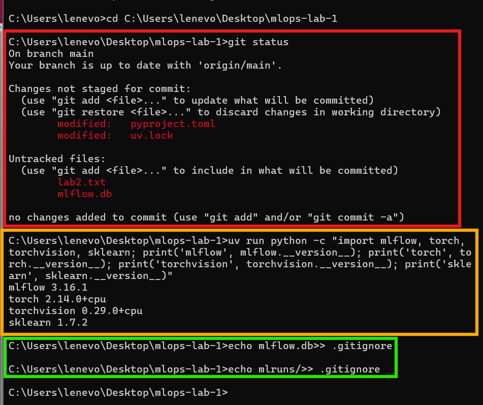
*git status after installing, library versions check, and adding mlflow files to .gitignore*

### Question 1

> **Look at pyproject.toml and uv.lock. What changed?**

In `pyproject.toml`, the dependencies list now includes `mlflow`, `torch`, `torchvision` and `scikit-learn` next to `pillow`, each with a minimum version (for example `mlflow>=3.16.1`). uv added them automatically when I ran `uv add`. I also added two sections before installing: `[[tool.uv.index]]`, which points to PyTorch's CPU-only package server, and `[tool.uv.sources]`, which tells uv to install `torch` and `torchvision` from there, since my laptop has no NVIDIA GPU.

The resulting `pyproject.toml`:

```toml
[project]
name = "mlops-lab-1"
version = "0.1.0"
requires-python = ">=3.10"
dependencies = [
    "mlflow>=3.16.1",
    "pillow>=12.3.0",
    "scikit-learn>=1.7.2",
    "torch>=2.14.0",
    "torchvision>=0.29.0",
]

[[tool.uv.index]]
name = "pytorch-cpu"
url = "https://download.pytorch.org/whl/cpu"
explicit = true

[tool.uv.sources]
torch = { index = "pytorch-cpu" }
torchvision = { index = "pytorch-cpu" }
```

### Running the local mlflow tracking server

In a separate terminal, from the root of the repo:

```bash
uv run mlflow server --host 127.0.0.1 --port 5000 --backend-store-uri sqlite:///mlflow.db --default-artifact-root ./mlruns
```

The MLflow UI then opens at http://127.0.0.1:5000 with an empty "Default" experiment:

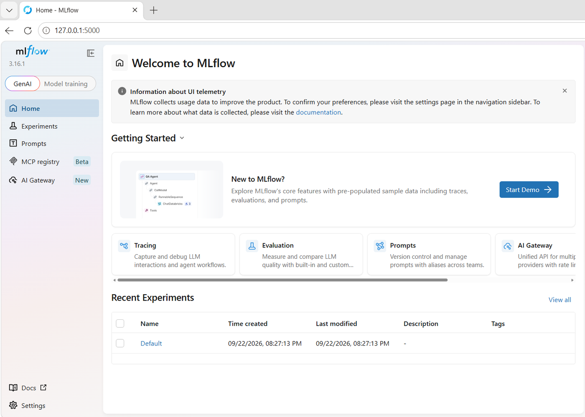
*MLflow UI with the empty Default experiment*

### Question 2

> **What is `--backend-store-uri` used for? What is `--default-artifact-root` used for? What is the difference between the metadata mlflow stores and the artifacts it stores?**

`--backend-store-uri` tells mlflow where to store the metadata of experiments and runs. Here it is `sqlite:///mlflow.db`, meaning a SQLite database saved in a single file, `mlflow.db`, in the project folder.

The metadata is small, structured information about each run: experiment name, run ID, start time, parameters (for example learning rate and batch size) and metrics (for example loss and accuracy per epoch). Because it is small and structured, it is stored in a database where mlflow can quickly search, sort and compare runs.

`--default-artifact-root` tells mlflow where to store the artifacts, meaning the files produced by a run. Here it is `./mlruns`, a normal folder in the project.

The artifacts are the actual output files of a run, mainly the trained model, but also possibly plots or other files. They can be large and of any type, so they are stored as files in a folder instead of in the database. The metadata of each run keeps a link to where its artifacts are stored.

### Keeping mlflow files out of git

On Windows, `echo` writes the quotes into the file, so I used the commands without quotes:

```bash
echo mlflow.db>> .gitignore
echo mlruns/>> .gitignore
git add .gitignore
git commit -m "Ignore local mlflow tracking files"
git push
```

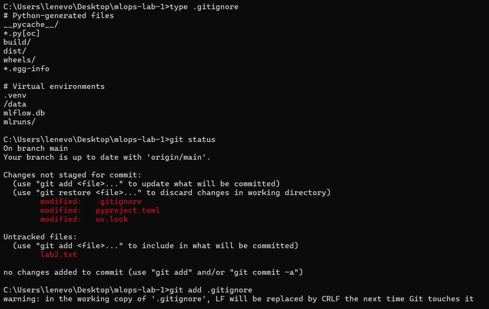
*.gitignore now ends with mlflow.db and mlruns/, and mlflow.db no longer appears as untracked*

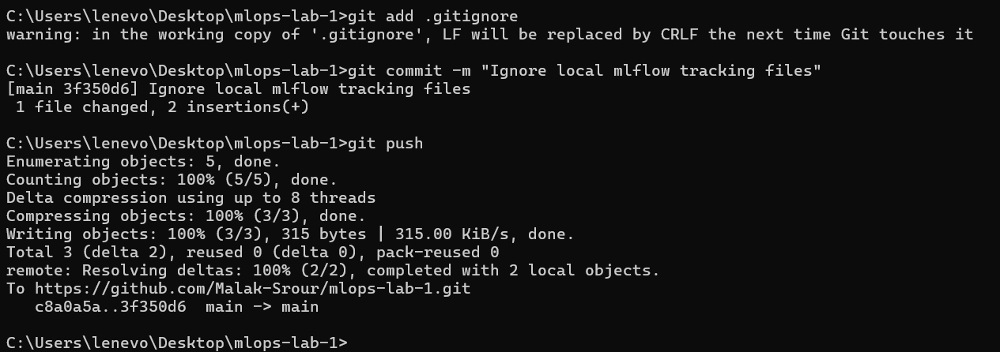
*Commit 3f350d6 pushed to GitHub*

### Question 3

> **Why shouldn't `mlflow.db` and `mlruns/` be tracked by git, and why shouldn't they be tracked by dvc either?**

They shouldn't be tracked by git because git is made for source code: small text files that we write and change on purpose. `mlflow.db` and `mlruns/` are outputs created automatically by mlflow, and they change every time we train a model. `mlflow.db` is a binary database file, so git cannot show meaningful differences in it, and `mlruns/` contains large files such as trained models. Tracking them would make the repository heavy and fill its history with automatic changes.

They shouldn't be tracked by dvc either because dvc is made for versioning datasets, by taking snapshots of data at specific moments. `mlflow.db` is a live database that the mlflow server keeps updating while it runs, so a snapshot would quickly be out of date. Also, mlflow already versions its own content: each run has a unique ID and its own artifacts. Tracking these files with dvc would mean two tools managing the same information.

So each tool keeps its own responsibility: git versions the code, dvc versions the data, and mlflow stores the runs, metrics and models.

### Pointing the code to the tracking server

```bash
uv run python -c "import mlflow; mlflow.set_tracking_uri('http://127.0.0.1:5000'); exp = mlflow.set_experiment('food11'); print('Experiment ID:', exp.experiment_id)"
```

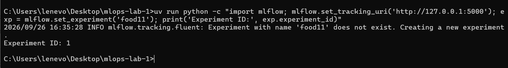
*mlflow creates the food11 experiment because it does not exist yet*

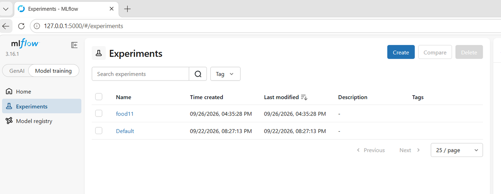
*The food11 experiment now appears in the UI next to Default*

### Question 4

> **What happens the first time you call `set_experiment` with a name that doesn't exist yet? Check the mlflow UI.**

If no experiment with that name exists, mlflow creates it automatically instead of giving an error. The terminal showed the message: "Experiment with name 'food11' does not exist. Creating a new experiment." The new experiment received the ID `1` (the "Default" experiment has ID `0`), and it is then set as the active experiment, so all following runs are logged inside it.

After refreshing the mlflow UI, the `food11` experiment appears in the experiments list next to `Default`, with no runs yet.

When I ran the same command a second time, the message did not appear and the same ID `1` was returned. This shows that `set_experiment` only creates the experiment the first time; after that, it simply selects the existing one.

## Part 2 - Training the Model

### The training script

I wrote `src/food11/train.py` step by step, testing each part before adding the next one:

| Part | What it does |
|---|---|
| 1. Settings and data | Reads `--dataset`, `--epochs`, `--lr` and `--batch-size` with argparse, and loads the training, validation and evaluation images with `ImageFolder` and `DataLoader`. |
| 2. Model | Loads ResNet18 pretrained on ImageNet and replaces its last layer (`fc`) so it outputs 11 classes instead of 1,000 (transfer learning). |
| 3. Training | For each epoch: trains on the training set with `CrossEntropyLoss` and the Adam optimizer, then measures loss and accuracy on the validation set. At the end, measures the test accuracy. |
| 4. MLflow logging | Wraps everything in `mlflow.start_run()`, logs the params once, logs `train_loss`, `val_loss` and `val_accuracy` every epoch with `step=epoch`, then logs `test_accuracy` and the trained model. |

**Part 1 test** - the data loads correctly: 11 classes, 1,100 training images (11 x 100), and 1,096 validation and test images (some categories have fewer than 100 images).

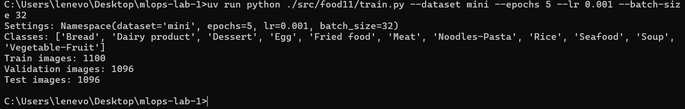
*Part 1: settings and datasets loaded*

**Part 2 test** - the pretrained weights are downloaded, the new last layer has 11 outputs, and one batch of shape `[32, 3, 128, 128]` gives an output of shape `[32, 11]`.

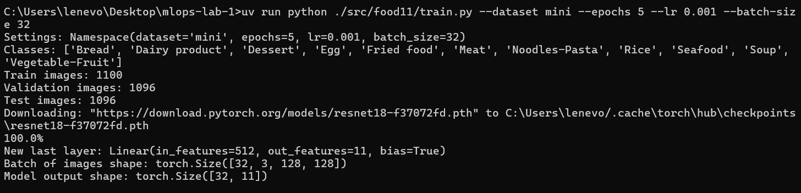
*Part 2: ResNet18 with a new 11-class last layer*

**Part 3 test** - the model learns: `train_loss` goes down every epoch and `val_accuracy` goes from 0.33 to 0.54. The validation loss stays much higher than the training loss, which shows some overfitting on this small dataset.

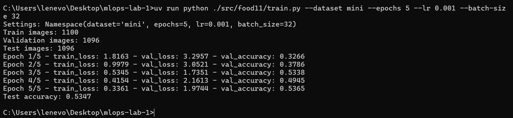
*Part 3: first training without mlflow*

### Main MLflow part of the code

```python
with mlflow.start_run() as run:
    # settings: logged once, they never change during the run
    mlflow.log_params({
        "dataset": args.dataset, "epochs": args.epochs,
        "lr": args.lr, "batch_size": args.batch_size, "model": "resnet18",
    })

    for epoch in range(1, args.epochs + 1):
        train_loss = train_one_epoch(model, train_loader, loss_fn, optimizer)
        val_loss, val_accuracy = evaluate(model, val_loader, loss_fn)
        # results: logged every epoch, step = epoch number
        mlflow.log_metric("train_loss", train_loss, step=epoch)
        mlflow.log_metric("val_loss", val_loss, step=epoch)
        mlflow.log_metric("val_accuracy", val_accuracy, step=epoch)

    test_loss, test_accuracy = evaluate(model, test_loader, loss_fn)
    mlflow.log_metric("test_accuracy", test_accuracy)

    # save the trained model inside the run
    mlflow.pytorch.log_model(model, name="model",
                             input_example=input_example,
                             serialization_format="pickle")
```

### Problem faced: saving the model

With mlflow 3.16, `mlflow.pytorch.log_model(model, "model")` failed at the end of training. The newer default format, `pt2`, first asked for an `input_example`:

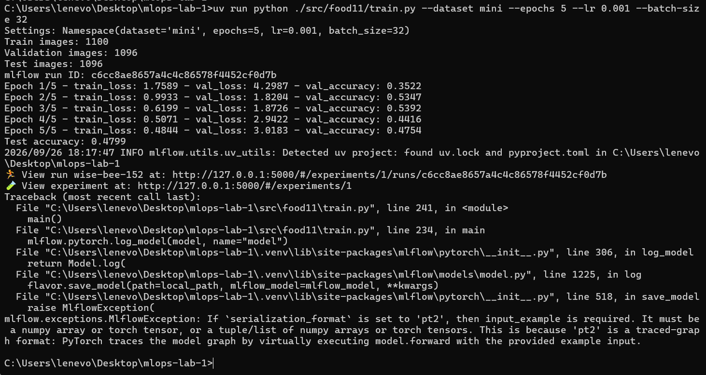
*First error: pt2 format requires an input_example*

After adding an example input, it failed again because the `pt2` format needs a very precise input description (a `TensorSpec` signature):

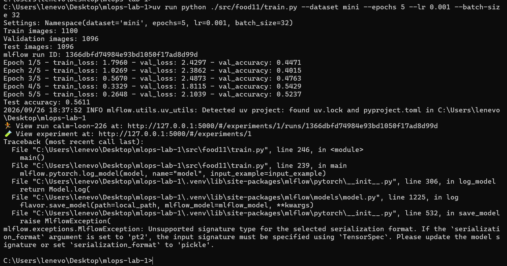
*Second error: pt2 format requires a TensorSpec signature*

**Fix:** as suggested by the error message, I saved the model with the classic `serialization_format="pickle"` and passed two real test images (as a numpy array) as the `input_example`. I tested the fix quickly with 1 epoch, and the model was saved. mlflow also exported the 116 dependencies from `uv.lock` next to the model, so the environment can be recreated later.

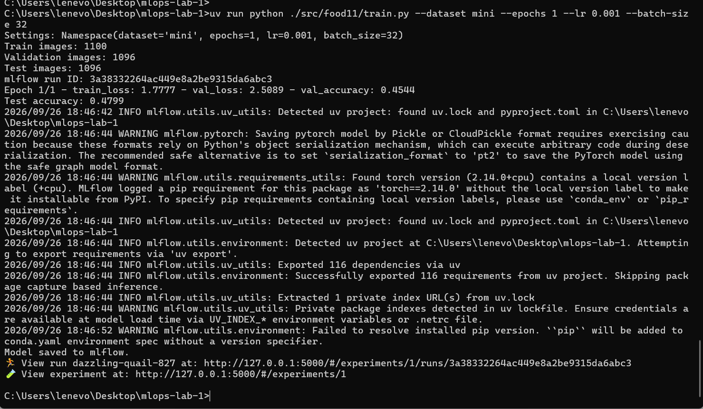
*1-epoch test run: "Model saved to mlflow."*

Because the errors happened inside the runs, mlflow marked them as Failed. I deleted the two failed runs and the 1-epoch test run so that only complete, real runs are compared:

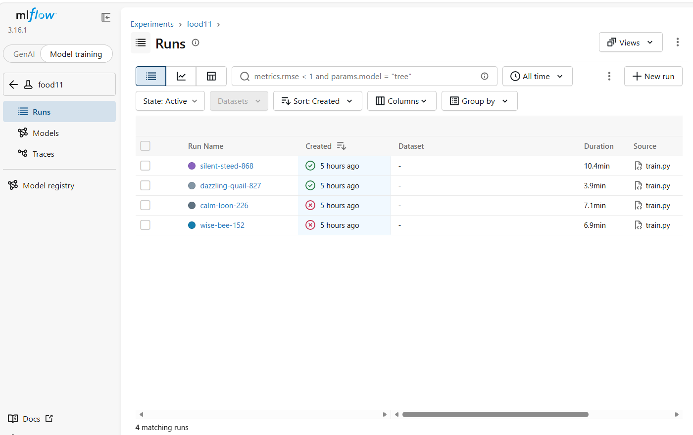
*Before cleanup: two failed runs and one test run*

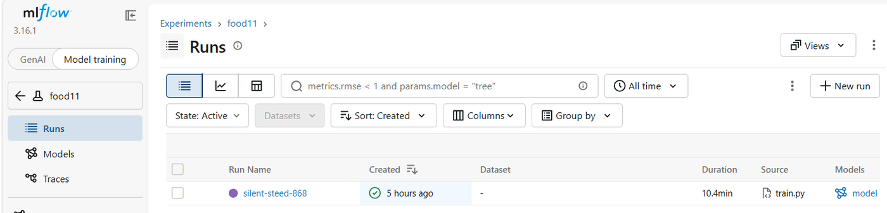
*After cleanup: only the real run remains, with its model*

### First complete run

```bash
uv run python ./src/food11/train.py --dataset mini --epochs 5 --lr 0.001 --batch-size 32
```

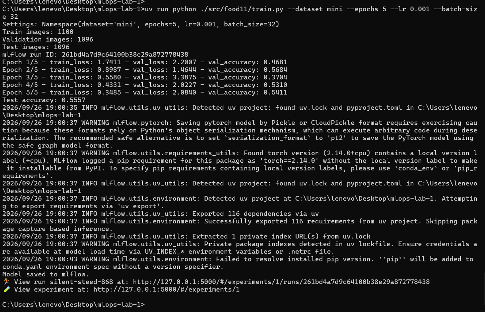
*Run silent-steed-868: training, test accuracy 0.5557, model saved*

### Question 5

> **What is the difference between `mlflow.log_param` and `mlflow.log_metric`? Why does `log_metric` take a `step` argument and `log_param` doesn't?**

`mlflow.log_param` records a setting chosen before training that stays fixed during the whole run, such as the learning rate, the batch size, the number of epochs or the dataset. Each param has a single value per run, so in my script I log them once at the start of the run. mlflow does not allow changing a param's value later in the same run.

`mlflow.log_metric` records a numeric result produced by the training, such as `train_loss`, `val_loss` or `val_accuracy`. These values change as the model learns, so a metric can be logged many times in the same run. In my script I log them at the end of every epoch, and `test_accuracy` once at the end. For example, in my run `val_accuracy` was logged 5 times: 0.4681, 0.5684, 0.3704, 0.5310 and 0.5411.

`log_metric` takes a `step` argument because a metric has a history: `step` tells mlflow which point in training each value belongs to (here, the epoch number). This lets mlflow keep the values in order and draw charts of how the loss and accuracy evolve. A param has only one fixed value, so there is no history and no need for a step.

### Question 6

> **Open the run in the mlflow UI. Find the params, the metric charts, and the logged model artifact. Where does the model artifact actually live on disk?**

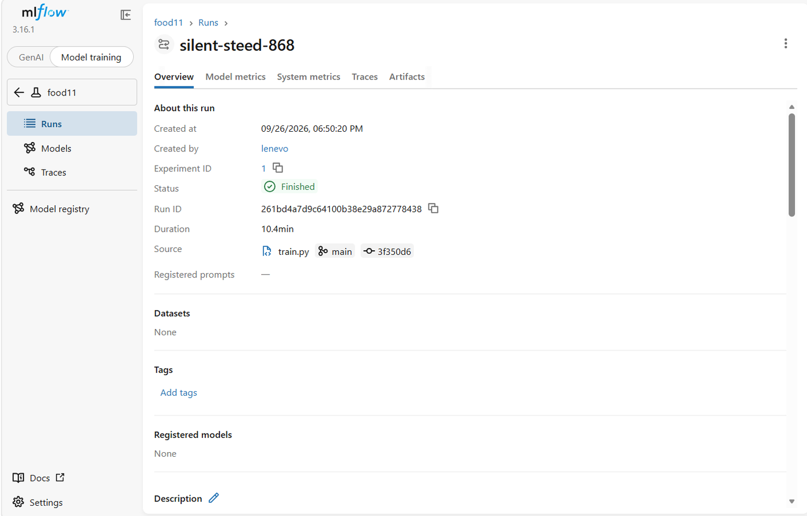
*Run overview: run ID, status, duration and source (train.py, branch main, commit)*

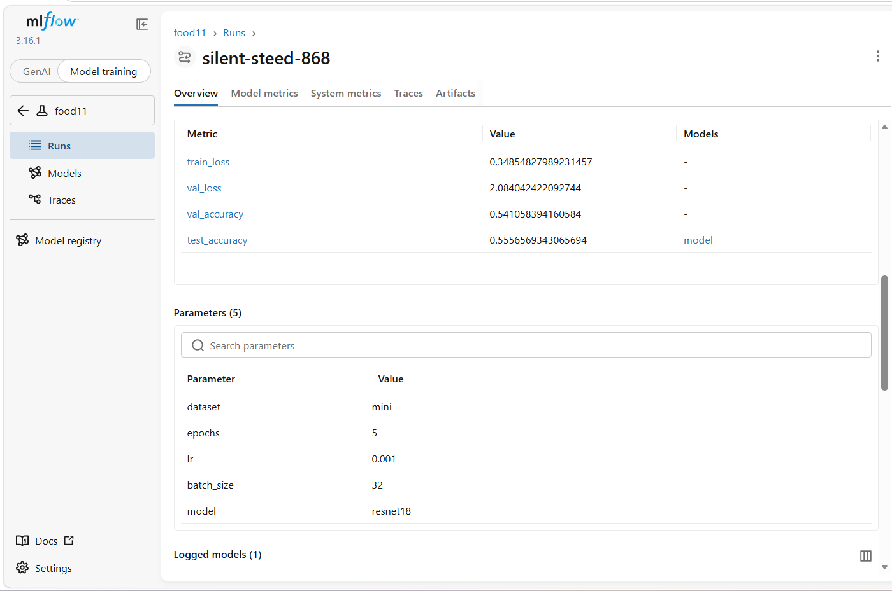
*Metrics (last value of each) and the 5 logged parameters*

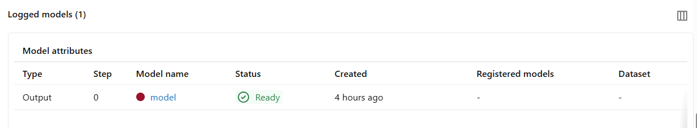
*Logged models section: the model is Ready*

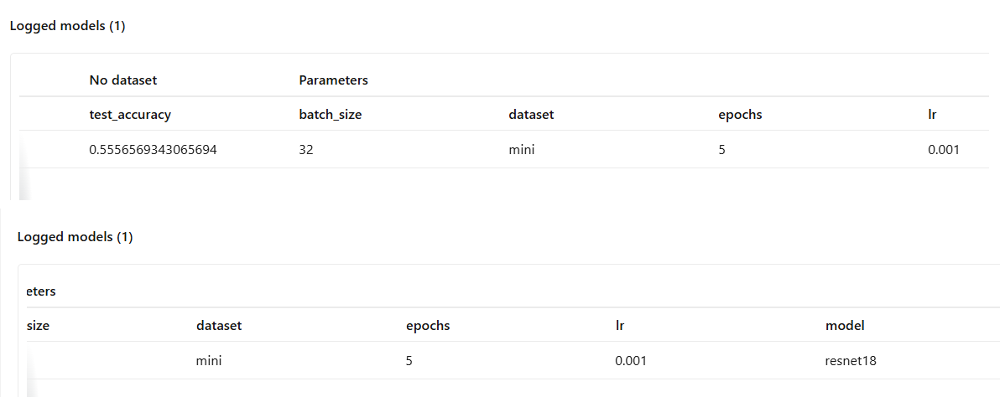
*The logged model is linked to its test_accuracy and to the params it was trained with*

In the mlflow UI, I opened the `food11` experiment and the run `silent-steed-868`. On the Overview tab, the Parameters table shows the 5 params I logged: `dataset=mini`, `epochs=5`, `lr=0.001`, `batch_size=32` and `model=resnet18`. The Metrics table shows the last value of each metric, for example `val_accuracy = 0.541` and `test_accuracy = 0.556`. On the Model metrics tab, there is a chart for `train_loss`, `val_loss` and `val_accuracy`, with the epoch number (the `step`) on the horizontal axis. The trained model appears in the Logged models section, where it is linked to the params it was trained with and to its `test_accuracy`, so the model can always be traced back to how it was produced.

The UI also shows the source of the run: the script `train.py`, the git branch `main` and the git commit, which links the run to the code version that produced it.

On disk, the model is stored in the artifact folder chosen with `--default-artifact-root`:

```
mlruns\1\models\m-4208b911966d4b4a880fcab642d9857a\artifacts\data\model.pth
```

where `1` is the experiment ID of `food11`, `m-4208b911966d4b4a880fcab642d9857a` is the unique ID of the logged model, and `model.pth` is the saved PyTorch model. The metadata of the run (params, metrics, and the link to this model) is stored separately in `mlflow.db`. This shows the split from Question 2: the database keeps the information about the run, and the `mlruns` folder keeps the actual files.

## Part 3 - Running Several Experiments and Comparing Them

I trained the model with different settings, changing one hyperparameter at a time. The run with `lr = 0.001` and `batch_size = 32` was already done (`silent-steed-868`), so I ran the 3 other configurations:

```bash
uv run python ./src/food11/train.py --dataset mini --epochs 5 --lr 0.01 --batch-size 32
uv run python ./src/food11/train.py --dataset mini --epochs 5 --lr 0.0001 --batch-size 32
uv run python ./src/food11/train.py --dataset mini --epochs 5 --lr 0.001 --batch-size 64
```

Validation accuracy per epoch for the 4 runs (from the terminal output):

| Epoch | lr 0.01, bs 32 | lr 0.001, bs 32 | lr 0.0001, bs 32 | lr 0.001, bs 64 |
|---|---|---|---|---|
| 1 | 0.0839 | 0.4681 | 0.6469 | 0.4325 |
| 2 | 0.1113 | 0.5684 | 0.6998 | 0.4717 |
| 3 | 0.1004 | 0.3704 | 0.7135 | 0.6040 |
| 4 | 0.1141 | 0.5310 | 0.7135 | 0.5602 |
| 5 | 0.1524 | 0.5411 | 0.7117 | 0.5684 |

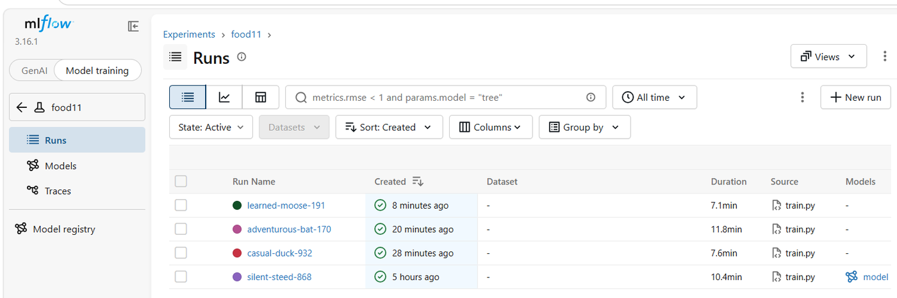
*The 4 runs in the food11 experiment*

### Question 7

> **In the mlflow UI, open the `food11` experiment. Select these runs and click "Compare". Which learning rate gave the best `val_accuracy`? Is higher always better?**

I selected the 4 runs in the `food11` experiment and clicked "Compare":

| Run | lr | batch_size | val_accuracy | test_accuracy |
|---|---|---|---|---|
| casual-duck-932 | 0.01 | 32 | 0.152 | 0.149 |
| silent-steed-868 | 0.001 | 32 | 0.541 | 0.556 |
| adventurous-bat-170 | 0.0001 | 32 | **0.712** | **0.757** |
| learned-moose-191 | 0.001 | 64 | 0.568 | 0.586 |

The best `val_accuracy` was obtained with the smallest learning rate, `lr = 0.0001` (0.712).

No, a higher learning rate is not always better. With `lr = 0.01`, the model barely learned anything: its accuracy stayed around 15%, close to random guessing between 11 classes (about 9%). Because we start from a pretrained ResNet18, the weights already contain useful knowledge. A large learning rate makes such big changes that it destroys this knowledge, while a small learning rate adjusts it gently to the new task. The run with `lr = 0.0001` was also more stable: its validation loss decreased smoothly, while the runs with `lr = 0.001` jumped up and down between epochs.

The learning rate has to be chosen carefully: too high and training becomes unstable, too low and training can become very slow. In this case, 0.0001 gave the best balance.

### Question 8

> **Use the parallel coordinates plot on the compare page to look at `lr`, `batch_size` and `val_accuracy` together. What pattern do you see?**

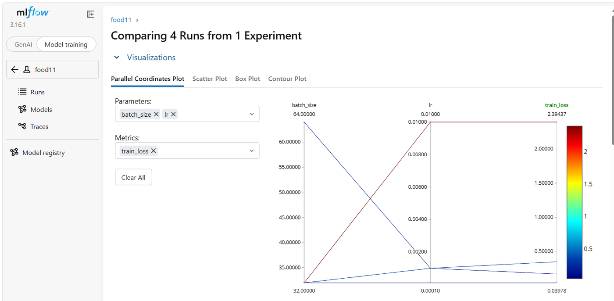
*Parallel coordinates plot with train_loss (the lr = 0.01 run has the highest loss)*

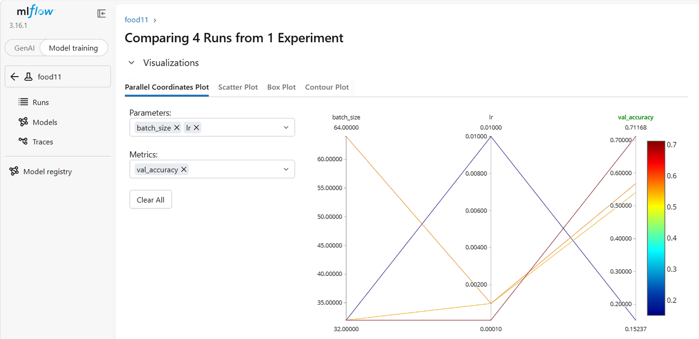
*Parallel coordinates plot with val_accuracy (red = high accuracy, blue = low accuracy)*

Visually, the lines cross each other between the `lr` axis and the `val_accuracy` axis, forming an X shape: the highest learning rate connects to the lowest accuracy, and the lowest learning rate connects to the highest accuracy. This crossing shows an inverse relationship between the learning rate and the validation accuracy in these runs.

### Question 9

> **Sort the runs table by `val_accuracy` descending. Which run is the best one? Note its run ID, you'll need it in the next lab.**

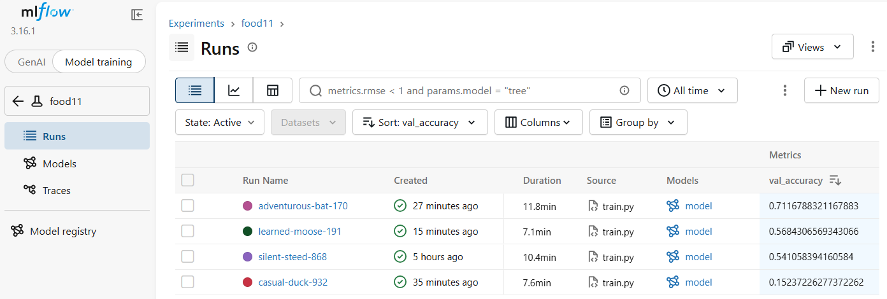
*Runs sorted by val_accuracy, highest first*

After sorting the runs table by `val_accuracy` in descending order, the runs are ranked as follows:

| Rank | Run | lr | batch_size | val_accuracy |
|---|---|---|---|---|
| 1 | adventurous-bat-170 | 0.0001 | 32 | **0.712** |
| 2 | learned-moose-191 | 0.001 | 64 | 0.568 |
| 3 | silent-steed-868 | 0.001 | 32 | 0.541 |
| 4 | casual-duck-932 | 0.01 | 32 | 0.152 |

The best run is **adventurous-bat-170**, trained with `lr = 0.0001` and `batch_size = 32`. It reached a validation accuracy of 0.712 and a test accuracy of 0.757.

**Run ID of the best run:** `8685c506f2d5489cbd68652780816347`

Note: the `val_accuracy` shown in the runs table is the last logged value (epoch 5), not the best value reached during training.

## Committing the Training Code

The code is versioned with git, while the run metadata, metrics and models stay in mlflow (not in git or dvc):

```bash
git add src/food11/train.py pyproject.toml uv.lock
git commit -m "Add training script with mlflow tracking"
git push
```
