# Lab 3 - Containerizing the Model with Docker

**Student:** Malak Srour  
**Repository:** https://github.com/Malak-Srour/mlops-lab-1  
**Date:** October 4, 2026  

## Overview

The best model of Lab 2 (`adventurous-bat-170`, run ID `8685c506f2d5489cbd68652780816347`) is registered in the mlflow Model Registry as `food11`, served by a FastAPI API (`src/food11/serve.py`), and packaged in a multi-stage Docker image.

### Checking Docker

After installing Docker Desktop, I checked that it works with `docker run hello-world`:

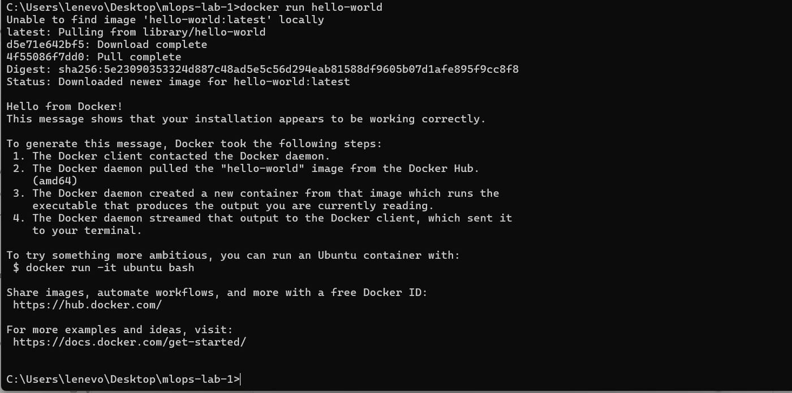
*Docker pulled the hello-world image and ran a container from it*


*The container created from the hello-world image*

## Part 1 - Registering the Model

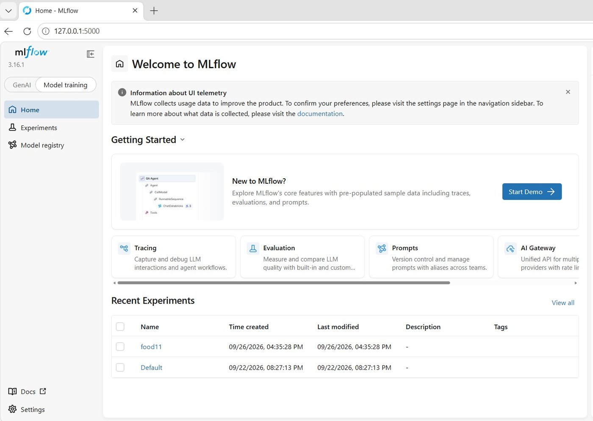
*mlflow tracking server with the food11 experiment from Lab 2*

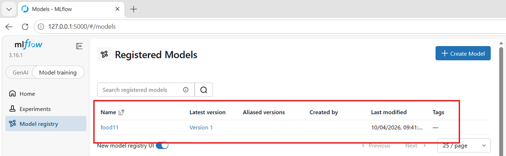
*Best run registered as food11, Version 1*

### Question 1

> **Open the "Models" tab in the mlflow UI. What version number was your model given? What's the difference between a run's logged model artifact and a registered model?**

My model was given **version 1** (the first version registered under the name `food11`).

- **Logged model:** saved automatically by each training run, identified only by an automatic ID and its run. Every run has one.
- **Registered model:** a named entry in the registry (`food11`) with version numbers, pointing to the logged model I choose. Code loads it by name and version instead of by run ID.

**Example:** logged models are all the photos on a phone; the registered model is an album of the chosen ones, numbered 1, 2, 3...

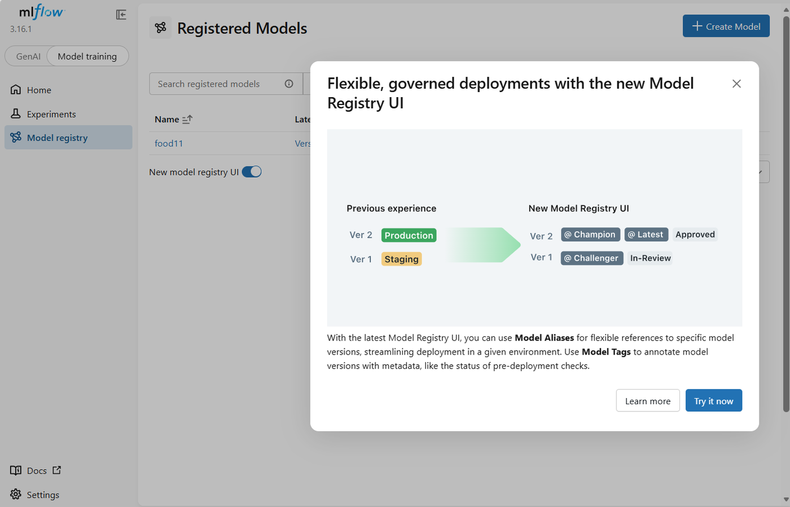
*mlflow UI: aliases and tags replace the old stages*

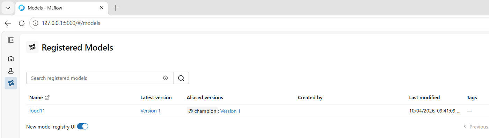
*Alias champion added to Version 1 from the UI*

### Question 2

> **What aliases replaced the old built-in stages in mlflow? Why version a model separately from the run that produced it, and why is an alias more flexible than a fixed stage name?**

The stages (`Staging`, `Production`, `Archived`) were replaced by **aliases** (named pointers to a version, such as `champion` or `challenger`) and free-form **tags**.

- **Versioning separately:** a run is one training attempt among many. The registry gives the chosen model a stable name and a version history, independent of the runs, so going back to an old version is easy.
- **Alias vs stage:** any name, several aliases at the same time, and an alias moves to another version in one step without changing the code. Example: in Question 7 I moved `champion` from version 1 to version 2.

## Part 2 - Serving Script

`serve.py` exposes `GET /health` and `POST /predict`, loads `models:/food11@champion` once at startup, and reads the mlflow address from `MLFLOW_TRACKING_URI`.

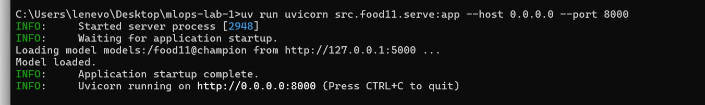
*API started locally with uvicorn, model loaded*

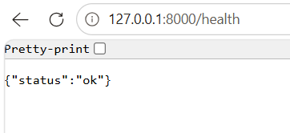
*GET /health*

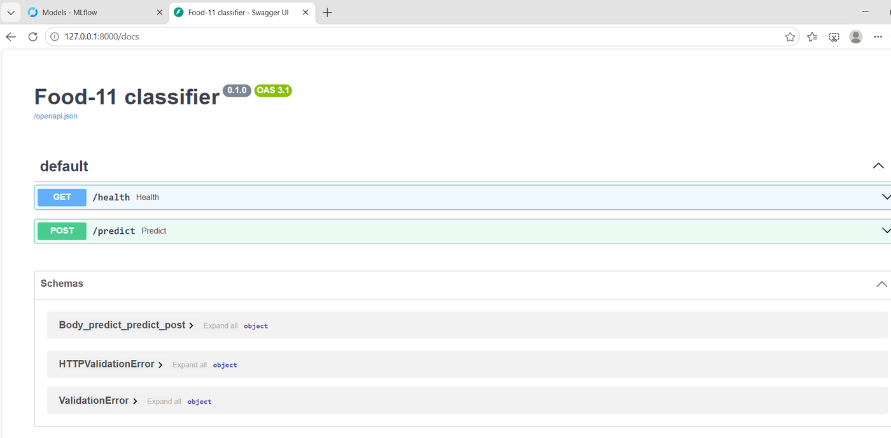
*FastAPI test page (/docs)*

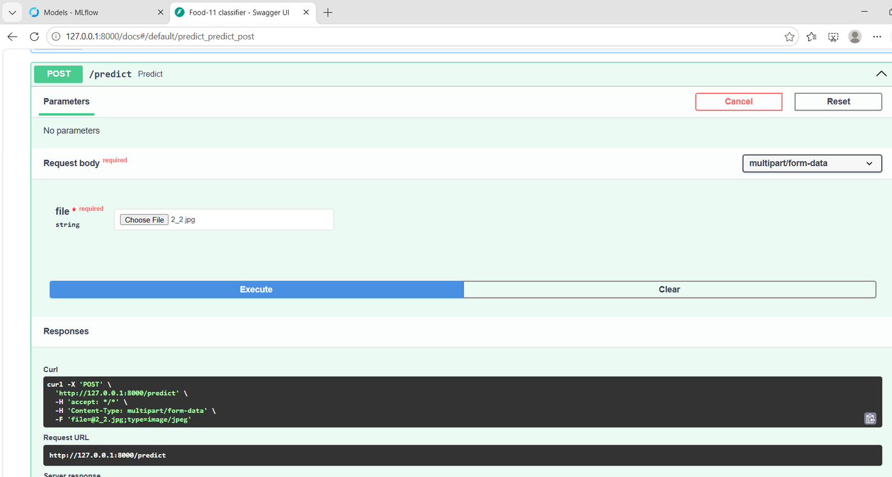
*POST /predict with an image*

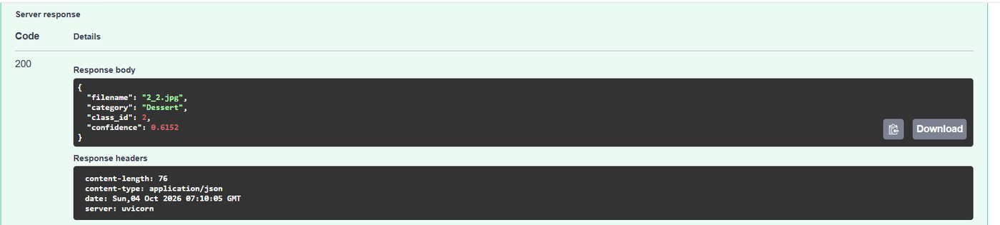
*Response: Dessert, confidence 0.6152*

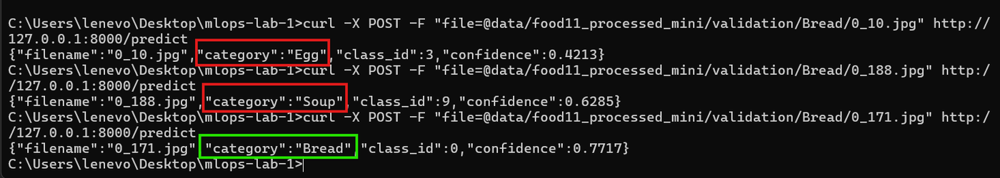
*curl tests on Bread images (about 71% validation accuracy, so some mistakes are expected)*

### Question 3

> **Why load the model through an mlflow model URI (`models:/food11@champion`) instead of pointing directly at the `.pth` file on disk? What would you have to change to serve a newer model version?**

- **Problem with the `.pth` path:** it only exists on my laptop, it is tied to one run, and changing the model means editing the code.
- **With the model URI:** mlflow finds the version that has the `champion` alias and loads it with its saved format and requirements. The code never changes.
- **To serve a newer version:** register it as a new version of `food11`, move `champion` to it, and restart the API. No code change.

## Part 3 - Docker Image

Multi-stage `Dockerfile` (builder stage runs `uv sync`, runtime stage copies only `.venv` and `src/` into a slim image) and a `.dockerignore`, built with `docker build -t food11-api:latest .`

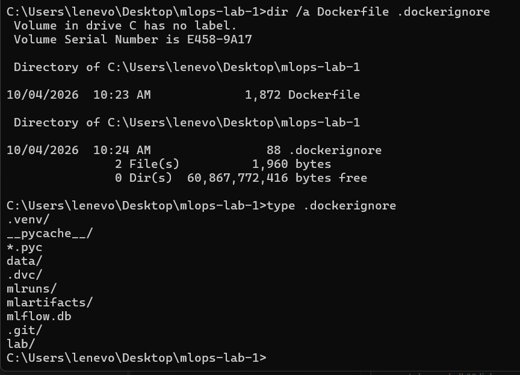
*Dockerfile and .dockerignore at the root of the repo*

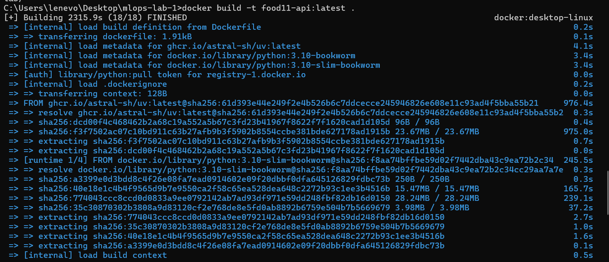
*First build: 2,315.9 s (mostly downloads)*

### Question 4

> **Why copy `pyproject.toml`/`uv.lock` and run `uv sync` before copying the rest of the source code, instead of copying everything at once? What happens to the build cache when you only change a line in `serve.py`?**

Each instruction is a cached layer; when one changes, it and all the layers after it are rebuilt. `uv sync`, the slowest step, only depends on `pyproject.toml` and `uv.lock`, so copying them first keeps it cached when only the code changes. With `COPY . .`, any edit would reinstall all the libraries.

**What happened:** after changing one line in `serve.py`, `COPY pyproject.toml uv.lock` and `RUN uv sync` were `CACHED` and only `COPY src/` ran: **3.4 s instead of 2,315.9 s**.

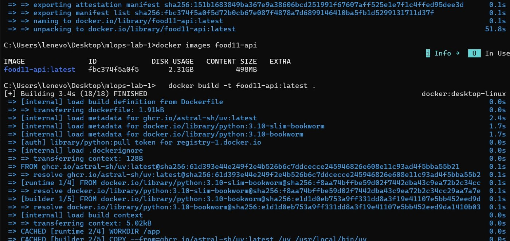
*Rebuild after changing serve.py: dependency layers CACHED*

### Question 5

> **What's the size difference between a naive single-stage image and your multi-stage one? Use `docker history <image>` to see which layers are the biggest.**

I compared it with a naive single-stage image (`Dockerfile.single`: full Python image, `COPY . .`, everything in one stage):

| Image | Disk usage | Compressed |
|---|---|---|
| `food11-api:latest` (multi-stage) | **2.31 GB** | 498 MB |
| `food11-api:single` (single-stage) | **5.52 GB** | 1.24 GB |

- **Biggest layer in both:** the Python libraries, mainly torch (1.67 GB in the multi-stage image, 3.15 GB in the single-stage one).
- **Why 3.21 GB more:** the single-stage image keeps build-only things: the full base image (≈ 1.08 GB vs ≈ 150 MB for slim), uv's download cache (≈ 1.5 GB) and the `uv` tool (54 MB).

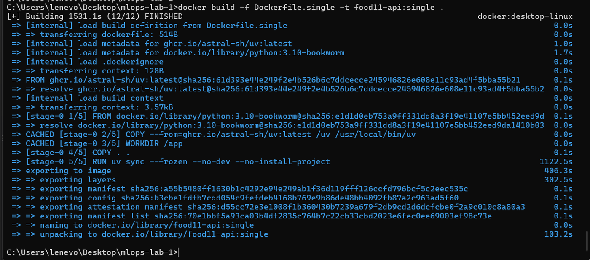
*Building the single-stage image*

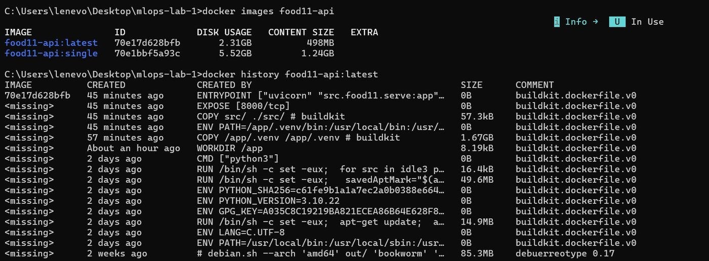
*docker images and docker history of the multi-stage image*

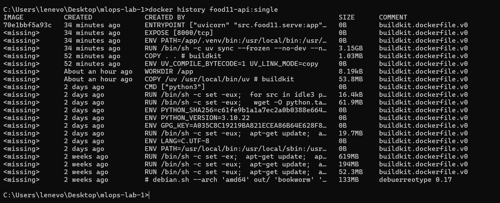
*docker history of the single-stage image*

### Question 6

> **What happens to build speed and image size if you forget the `.dockerignore`? Which of the excluded folders would actually break the build if they were sent to the Docker daemon?**

- **Build speed:** the build context would be ≈ 3.6 GB (`data` 1.19 GB, `.dvc` 1.14 GB, `.venv` 1.00 GB, `mlruns` 0.23 GB...) instead of **962 kB**, sent at every build.
- **Image size:** same with my Dockerfile (it copies only `pyproject.toml`, `uv.lock` and `src/`), but several GB bigger with `COPY . .`.
- **Breaks the build:** `.venv/`, a Windows environment that would overwrite `/app/.venv` in the Linux container.

## Part 4 - Running the Container

`docker run -p 8000:8000 -e MLFLOW_TRACKING_URI=http://host.docker.internal:5000 food11-api:latest`

### Question 7

> **Why can't the container simply use `127.0.0.1:5000` to reach the mlflow server on your host? What does `host.docker.internal` resolve to?**

A container has its own network: inside it, `127.0.0.1` is the container itself, not my laptop, so mlflow is not there. `host.docker.internal` is a Docker Desktop name that points to the host. In my container:

```text
127.0.0.1 inside the container is: d27f7c5806ce
host.docker.internal -> 192.168.65.254
```

**Extra steps needed on my setup:**

- **Problem:** mlflow refused the container's requests (`403 Invalid Host header`). **Fix:** start the mlflow server with `--allowed-hosts` including `host.docker.internal`.
- **Problem:** the model files were saved as a Windows path (`C:/Users/.../mlruns`) that the container cannot see (`No such artifact`). **Fix:** start the server with `--artifacts-destination ./mlartifacts` so it sends the files over HTTP, register the same model again as **version 2** (`publish_for_serving.py`) and move `champion` to it.

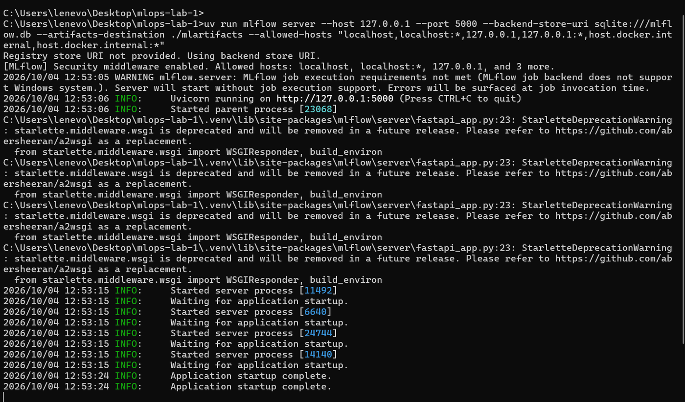
*mlflow server with --artifacts-destination and --allowed-hosts*

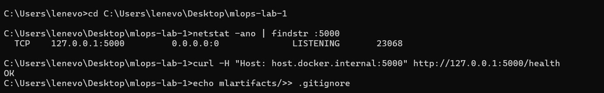
*The server accepts the host name host.docker.internal (OK)*

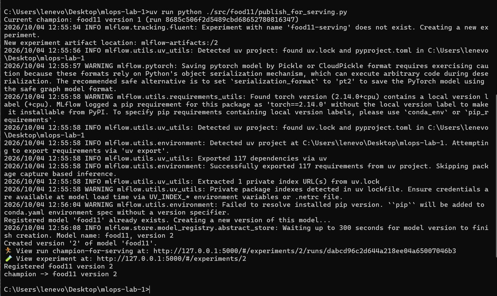
*Model registered as version 2 and champion moved to it*

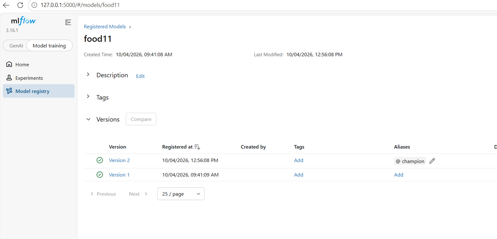
*food11: @champion on Version 2*

**Result:** the container loads the model and predicts like the local API (Bread, 0.7717).

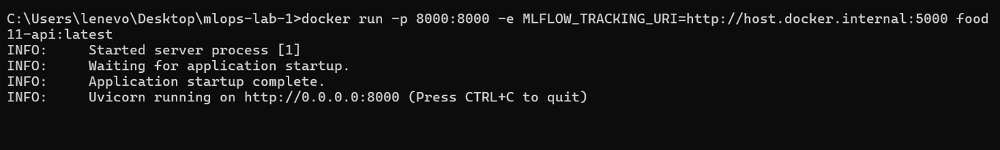
*Container running*

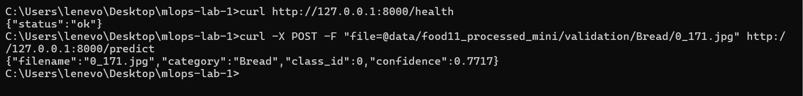
*Prediction from the container*

### Question 8

> **Stop the container and start a new one from the same image. Does the model still load correctly without you rebuilding? What does that tell you about what's baked into the image versus fetched at runtime?**

Yes: a new container from the same image loaded the model again without rebuilding (`9_10.jpg` → Soup, 0.8539).

- **Baked into the image:** Python, the libraries and `serve.py`.
- **Fetched at runtime:** the model (`food11@champion`) from mlflow, at each start.
- So moving the alias and restarting serves a new model, but the container needs the mlflow server to be reachable.

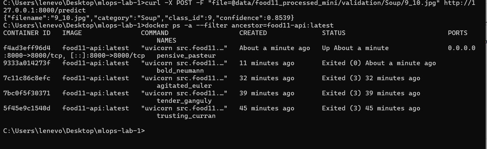
*Each docker run creates a new container from the same image*

### Question 9

> **The Dockerfile and image are versioned differently: one lives in git, the other doesn't (yet). What's still missing before another machine (like a CI runner or a Kubernetes cluster) could reliably pull and run the exact image you just built?**

The Dockerfile is in git, but the image only exists on my laptop. Still missing:

- **A registry** (Docker Hub, ghcr.io) to push the image and pull it elsewhere.
- **A unique tag** (git commit or version number) instead of `latest`.
- **Pull credentials** for the CI runner or the cluster.
- **Pinned base images** (`uv:latest` can change over time).
- **A CI pipeline** that builds, tags and pushes the image on every commit.
- **A reachable mlflow server and model storage** (`host.docker.internal` and `mlartifacts/` only work on my laptop).
