# Lab 4 - Orchestrating the App with Docker Compose

**Student:** Malak Srour  
**Repository:** https://github.com/Malak-Srour/mlops-lab-1  

### Question 1

> **What happens to everything written to `/mlflow-data` if you never mount a volume there and just `docker run` this image standalone? Try it: run the container, register nothing, stop it, remove it, start a new one from the same image — what do you see in the UI?**

It is written in the container's own writable layer, so it is **deleted together with the container**.

- **Test:** I ran the image without a volume (`docker run -d --name mlflow-test -p 5000:5000 food11-mlflow`), created an experiment `test-q1`, then ran `docker stop` + `docker rm` and started a new container from the same image.
- **Result:** `test-q1` was gone and `Default` was created again. The new container started with a new empty database:

```text
2026/10/09 18:31:12 INFO ... Creating initial MLflow database tables...
-rw-r--r-- 1 root root 954368 Oct  9 18:31 mlflow.db
```

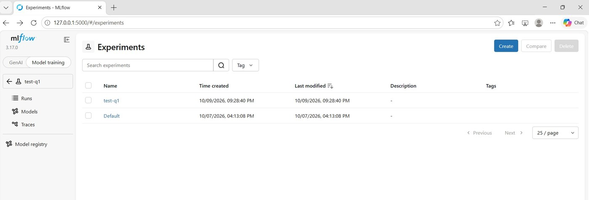
*Standalone mlflow container with the experiment test-q1*

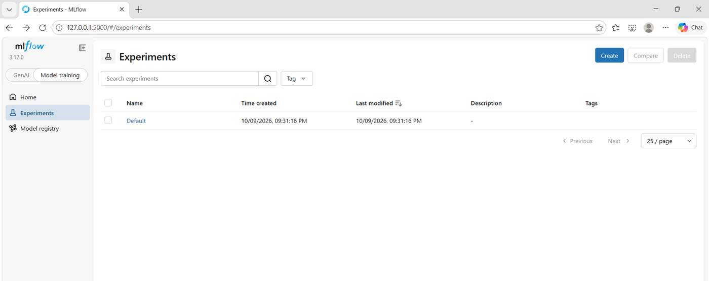
*New container from the same image: test-q1 is gone, Default is re-created*


### Question 2

> **Why a named volume here instead of a bind mount to a folder in your repo (the way you might for local dev)? Would a bind mount work just as well?**

A bind mount would also keep the data, but a named volume is better here:

- **Managed by Docker:** no path that only exists on my laptop (`C:\Users\...`), so the same `docker-compose.yml` works on any machine.
- **Not in the repo:** `mlflow.db` and the model files are not mixed with the code or committed by mistake.
- **No Windows problems:** a bind mount goes through file sharing between Windows and Docker's Linux VM, which is slower and can cause permission issues for SQLite.
- **Deleted only on purpose:** with `docker compose down -v` (Question 10).

A bind mount is still useful in local development, when I want to see or edit the files directly.

## Part 2 - Inference and Frontend Services

`serve.py` is unchanged. `frontend/app.py`, `frontend/Dockerfile` and `docker-compose.yml` are the lab's files. I checked that `serve.py` returns the keys that `app.py` reads:

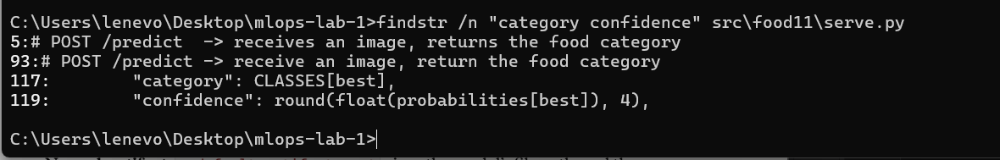
*serve.py returns category and confidence*

### Question 3

> **In Lab 3 you had to use `host.docker.internal` or `--network host` to reach mlflow from inside the container. In this lab, `MLFLOW_TRACKING_URI` will simply be `http://mlflow:5000`. Why does that hostname resolve now when it didn't before?**

Compose puts the three services on one private network (`mlops-lab-1_default`), and its DNS resolves each **service name** to the IP of that container. In Lab 3, mlflow ran on my laptop, outside any Docker network, so only `host.docker.internal` could reach it.

**Proof:** inside the inference container, `socket.gethostbyname('mlflow')` returns `172.18.0.2`, the IP of the mlflow container (`docker compose exec inference python -c "import socket; print(socket.gethostbyname('mlflow'))"`). The mlflow logs also show the requests coming from `172.18.0.3`, the inference container.

### Question 4

> **Why does the frontend read `INFERENCE_URL` from an environment variable instead of hardcoding `http://inference:8000`? Think about what happens if you ever `docker run` this frontend image on its own, outside Compose.**

The name `inference` only exists inside the Compose network. Outside Compose, a hardcoded `http://inference:8000` would always fail. With the variable, the same image works anywhere without a rebuild, for example with `-e INFERENCE_URL=http://host.docker.internal:8000`. It is the same idea as `MLFLOW_TRACKING_URI` in `serve.py`.

## Part 3 - Wiring It Together with Docker Compose

### Question 5

> **Only `mlflow` and `frontend` publish a port to the host. `inference` doesn't. Why not, and how does the frontend still reach it?**

Only what a person opens in the browser needs a published port: the mlflow UI (5000) and the upload page (8501). Nobody calls the API directly. The frontend reaches it inside the Compose network at `http://inference:8000` (the container's own port). Not publishing it also keeps the API hidden from outside.

### Question 6

> **`depends_on` here only waits for the mlflow container process to start, not for the tracking server inside it to be ready to accept connections. If your `serve.py` tries to load the Staging model at startup and mlflow isn't ready yet, what happens to the `inference` container? Look at `docker compose logs inference` if it fails.**

The container **stops**. `serve.py` loads the model once at startup. If that fails, the API cannot start and the container stays `Exited`, because nothing restarts it. `docker compose logs inference` showed this twice:

```text
mlflow-1     | ... Rejected request with invalid Host header: mlflow:5000
inference-1  | ... 403 ... 'Invalid Host header - possible DNS rebinding attack detected'
inference-1  | ERROR:    Application startup failed. Exiting.
inference-1 exited with code 3

inference-1  | ... RESOURCE_DOES_NOT_EXIST: Registered Model with name=food11 not found
inference-1  | ERROR:    Application startup failed. Exiting.
```

- **1st failure:** mlflow refused the name `mlflow` (403). Fixed with `--allowed-hosts` (Part 4).
- **2nd failure:** the new mlflow was still empty. Fixed by adding the model, then `docker compose restart inference`.

Start order is not readiness: in the logs, inference starts before mlflow prints `Uvicorn running`. A more robust setup would use `restart: on-failure`, a retry loop in `serve.py`, or a `healthcheck` on mlflow with `depends_on: condition: service_healthy`.

## Part 4 - Bringing the Stack Up

**Extra steps needed on my setup:**

- **Problem:** mlflow refused inference (403). The lab's image installs the latest mlflow (3.17.0), which only accepts `localhost`. **Fix:** I changed only the `CMD` of `mlflow/Dockerfile`: `--allowed-hosts` with `mlflow`, and `--artifacts-destination /mlflow-data/mlartifacts` instead of `--default-artifact-root`, so the model files go to the server over HTTP and into the volume (same problems as Lab 3, Question 7).
- **Problem:** slow network. `pip install streamlit` timed out (`ReadTimeoutError`) while Compose built the three images at the same time. **Fix:** `docker compose build frontend` alone (the pip step took 703 s).
- **Problem:** the inference build lost Lab 3's cache (the base images were downloaded again, and `uv:latest` even changed between my two attempts), then `uv sync` failed on a network timeout after about 50 minutes. **Fix:** same Dockerfile and code as Lab 3, so I reused its image (`docker tag food11-api:latest mlops-lab-1-inference:latest`) and ran `docker compose up` without `--build`.
- **Problem:** the new mlflow starts empty, so `food11@champion` did not exist. **Fix (no retraining):** `src/food11/copy_model_to_compose.py` copies two Lab 2 models from their files (`mlruns/1/models/m-.../artifacts`) into the mlflow container as runs. In the UI, I registered `copy-of-m-4208b911` (silent-steed-868, the weaker model) as **food11 version 1** with the alias `champion` (the lab's "Staging") and restarted inference.

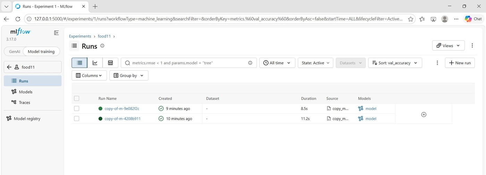
*The two Lab 2 models copied into the mlflow container*

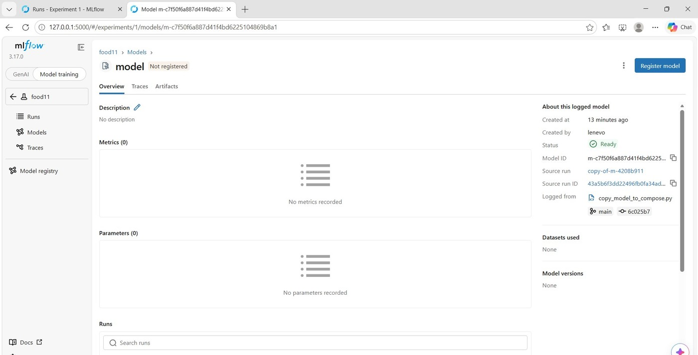
*Logged model from copy-of-m-4208b911, registered from the UI*

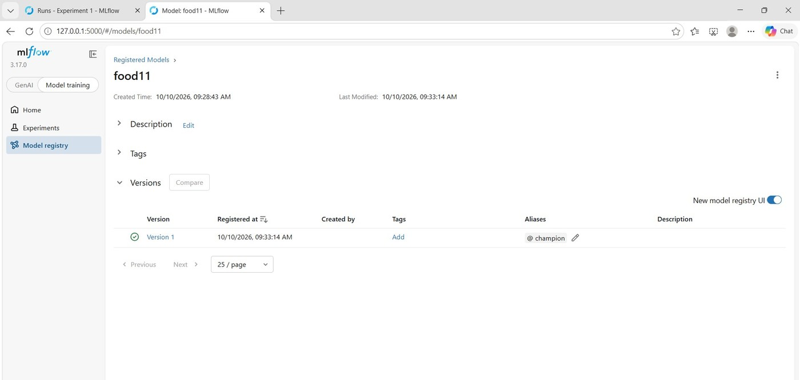
*food11 version 1 with the alias champion*

**Result:** the upload page returns a prediction through the three services.

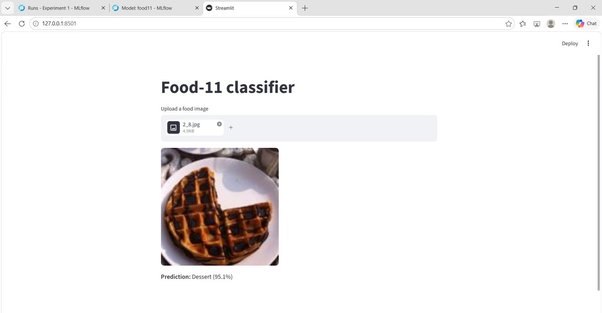
*Frontend: 2_8.jpg (waffles) predicted as Dessert (95.1%) with version 1*

### Question 7

> **Run `docker compose ps`. Which services have a published port listed, and which don't? Does that match what you'd expect from the `docker-compose.yml`?**

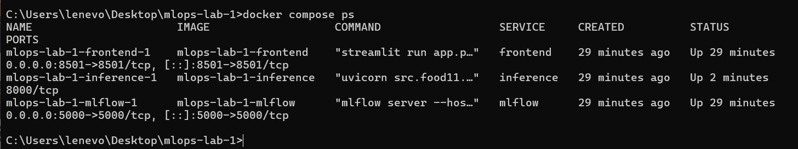
*docker compose ps*

- **Published:** `frontend` (`0.0.0.0:8501->8501/tcp`) and `mlflow` (`0.0.0.0:5000->5000/tcp`). The arrow maps a port of my laptop to the container.
- **Not published:** `inference` shows only `8000/tcp`, with no arrow. That port is reachable only inside the Compose network.

Yes, it matches: only `mlflow` and `frontend` have `ports:` in `docker-compose.yml`. (inference shows `Up 2 minutes` because I restarted it after registering the model.)

## Part 5 - Promoting a New Model Version

In the UI, I registered `copy-of-m-9e082f2c` (adventurous-bat-170, my best Lab 2 model) as **version 2** and moved `champion` to it. Version 1 lost the alias automatically.

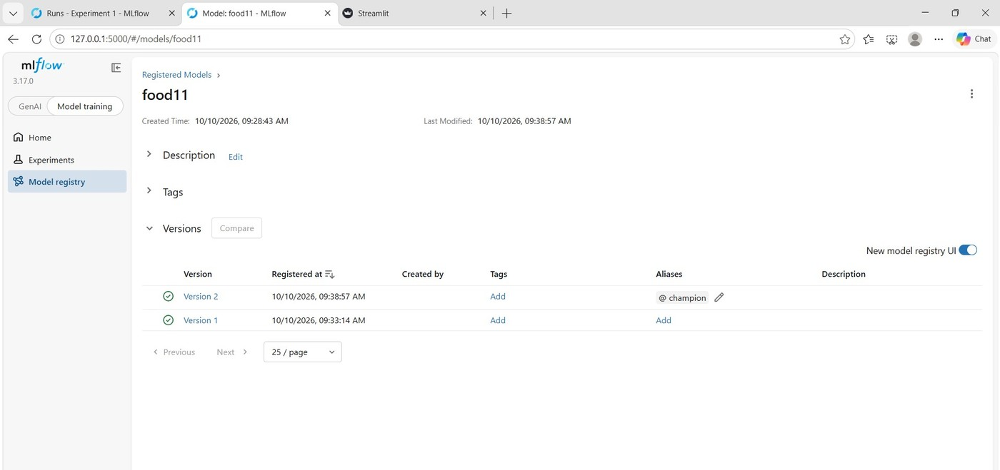
*champion moved to version 2*

### Question 8

> **Refresh the frontend and upload an image again. Does the prediction come from the new model version, or the old one? Your `serve.py` loads the model once, at startup — what single command lets you pick up the new Staging version without rebuilding any image?**

From the **old** version: inference keeps version 1 in memory and does not see the alias change. The command is `docker compose restart inference` (1.4 s, no rebuild).

| Moment | Model in memory | 2_8.jpg (waffles) |
|---|---|---|
| Before the change | version 1 | Dessert (95.1%) |
| `champion` moved, no restart | version 1 | Dessert (95.1%) |
| After `docker compose restart inference` | version 2 | Dessert (37.5%) |

Lower confidence does not mean worse: both answers are correct, and version 2 has the better validation accuracy.

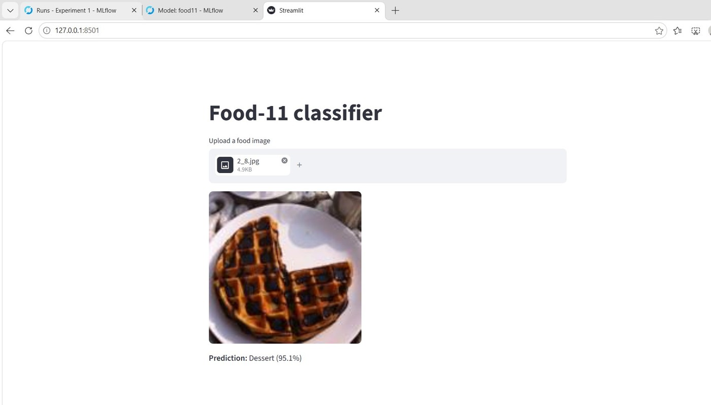
*After moving champion, without restart: same result as version 1*

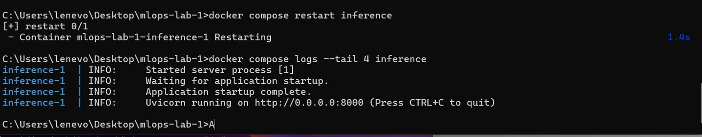
*docker compose restart inference: the model is loaded again*

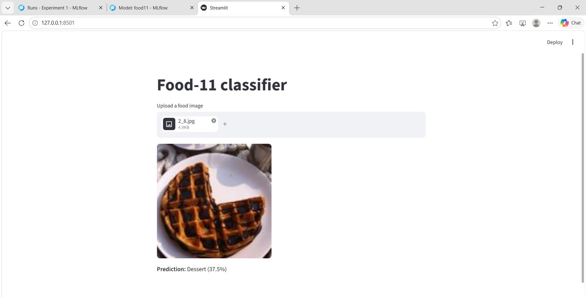
*After the restart: Dessert (37.5%) from version 2*

### Question 9

> **Why does `restart` alone work here — no rebuild needed? What does that tell you about what's baked into the inference image versus fetched at container startup?**

Because the model is **not inside the image**:

- **Baked into the image:** Python, the libraries and `serve.py`.
- **Fetched at startup:** the model (`models:/food11@champion` from `http://mlflow:5000`) and the settings from environment variables.

So a new model only needs a moved alias and a restart. The same image served two model versions. The downside: inference needs mlflow at startup (Question 6).

## Part 6 - Persistence Check

### Question 10

> **Is your registered model and its Staging assignment still there after this `down`/`up` cycle? Now try `docker compose down -v` followed by `docker compose up` — what's different this time, and why?**

**`down` then `up`: everything is still there.** `down` removes the containers and the network, not the volume. `up` printed no `Volume ... Created` line and no `Creating initial MLflow database tables...`, and inference started by itself, loading version 2 from the volume:

```text
mlflow-1     | ... "GET .../registered-models/alias?name=food11&alias=champion" 200 OK
mlflow-1     | ... "GET .../model-versions/get-download-uri?name=food11&version=2" 200 OK
mlflow-1     | ... "GET .../models/m-7637dd0f.../artifacts/data/model.pth" 200 OK
inference-1  | INFO:     Application startup complete.
```

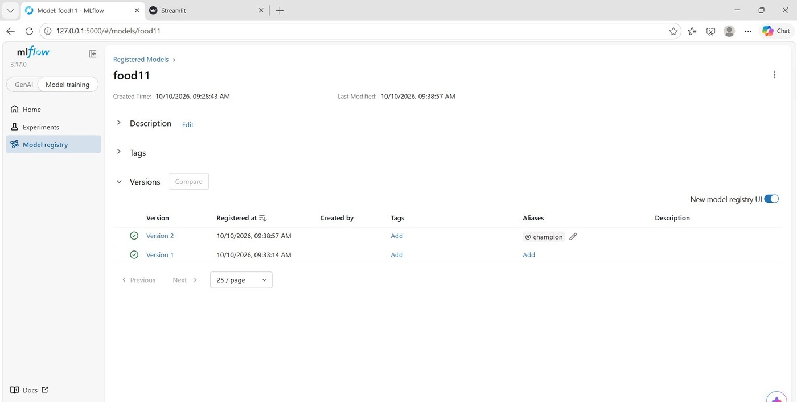
*After down and up: version 1, version 2 and champion are still there*

**`down -v` then `up`: everything is gone.** `-v` also deletes the volume, so Compose creates a new empty one and mlflow creates a new database. The registry is empty and inference fails again with `Registered Model with name=food11 not found`.

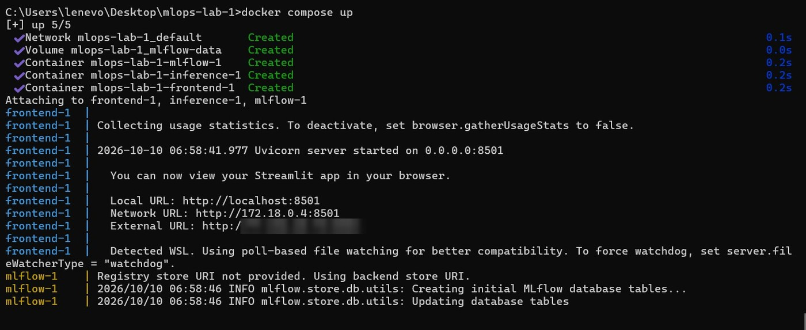
*After down -v and up: new volume and new empty database*

**Why:** the data lives in the volume, not in the containers. `down` is a safe restart, while `down -v` is a full reset.

## Part 7 - Commit and Scaling

Committed: `mlflow/Dockerfile`, `frontend/Dockerfile`, `frontend/app.py`, `docker-compose.yml` and `src/food11/copy_model_to_compose.py`.

### Question 11

> **This compose file is still meant to run on one machine. What would have to change for the `inference` service to run as three replicas behind a load balancer, or for the mlflow service to survive a machine failure? (You don't need to implement this — just name what Docker Compose can't give you here.)**

Compose runs everything on **one machine**: if it stops, all the services stop.

- **3 inference replicas:** `docker compose up --scale inference=3` only works on one machine. Missing: a load balancer in front of the replicas, health checks (for example `/health`), rolling updates, and spreading the replicas over several machines.
- **mlflow surviving a machine failure:** SQLite and the model files are in a volume on my laptop's disk. Missing: a real database server (PostgreSQL), shared storage for the model files (S3, MinIO), several mlflow servers, and restarting a failed service on another machine.

This is what an orchestrator like **Kubernetes** provides (replicas, load balancing, health checks, persistent storage).
